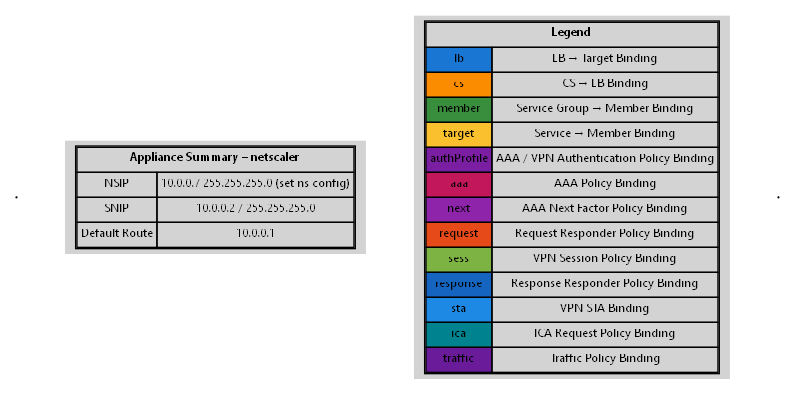
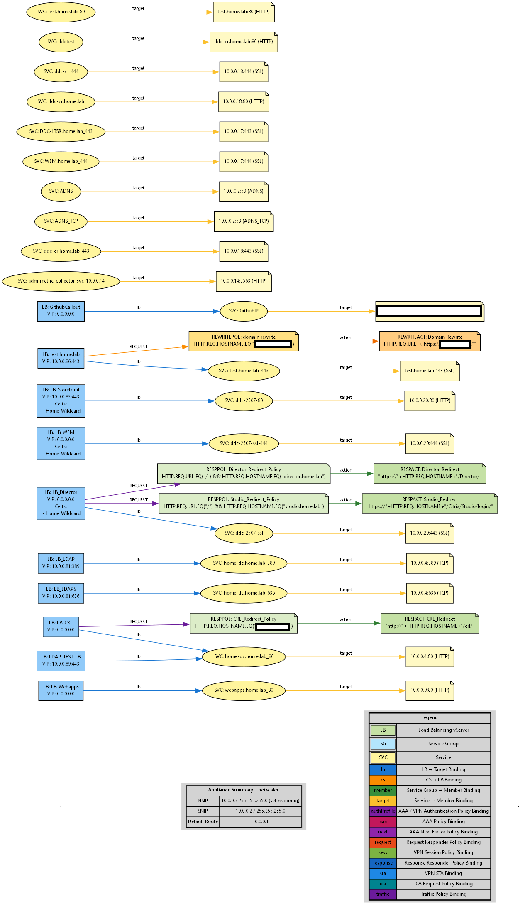

# NetScaler Graphical Documentation Tool

Make sure to run this PowerShell script under PowerShell 7 to ensure compatibility with the code.

This powershell script will take an ns.conf file from any NetScaler and generate a .DOT, .PNG, or .SVG file for visualizing the NetScaler Config.

SVG files can be imported into Visio and then edited as you need.

To fully visualize the export you will need to get the open source graph visualizer from [Graphviz](https://graphviz.org).

You can either manually convert the generated .dot file after run, or use -PNG and/or -SVG in your command to automatically generate it after install.

As with all my scripts this is a work in progress, let me know if you have weird looking exports, or requests to add to the documentation process.

### UPDATES
* Added dash normalization so that all ASCII dash like characters are converted to the same ASCII dash for proper rendering.

#### Planned additions

* [ ] Better nfactor display for complex authentication processes
* [ ] NetScaler Gateway Group details for advanced Gateway Portal Designs
* [ ] Better Route tables for complex static routes
* [ ] Better labeling of various components

## Lauch Syntax

You can modify what is generated by specifying different options during script run.

`.\Generate-NetScaler-Diagram.ps1" "Path to import\ns.conf" "Path to export\ns.dot" -IncludeSG -IncludeAAA -IncludeVPN -IncludeCS -IncludeLB -IncludeGSLB -PNG -SVG`

-IncludeSG (Include Services and Service Group Detail)

-InclueAAA (Include AAA vServer and and Detailed Authentication Bindings)

-IncludeVPN (Include NetScaler Gateway and Detailed Bindings)

-IncludeCS (Include Content Switch vServers and Detailed Bindings)

-IncludeLB (Include Load Balancers and Detailed Bindings)

-IncludeGSLB (Include GSLB vServers, Sites, and Services)

-PNG (Generate a PNG graphic from the .dot file)

-SVG (Generate an SVG file from the .dot file)

## Pre-requisites

* Export your ns.conf file from your NetScaler.  System -> Diagnostics -> Running configuration -> Save text to a file
* Download the Generate-NetScaler-Diagram.ps1 to a local directory
* Install GraphVis from the above link.  If you install GraphVis to a directory other than the default, edit the path to GraphVis in the Generate-NetScaler-Diagram.ps1 script.
* `$GraphvizPath = "C:\Program Files\Graphviz\bin\dot.exe"`

## Examples

### Run script with no options

### Run script with Load Balancers and Service Groups

