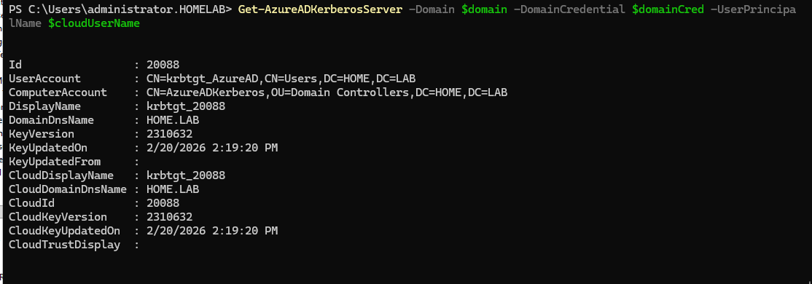
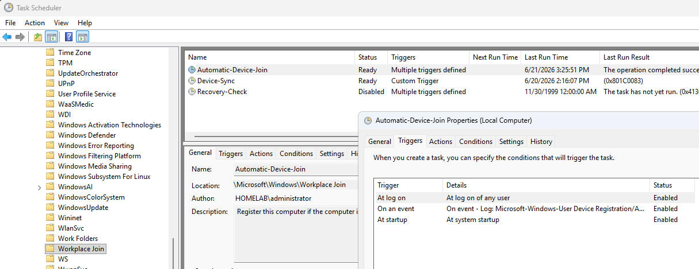

## Hybrid Joined Devices after WS-Trust retirement

### 1. DCs up to supported versions (I recommend having at least 1 2025 DC for future updates)

Windows Server 2016, with KB3534307 and later

Windows Server 2019, with KB4534321 and later

Windows Server 2022

Windows Server 2025

### 2. Domain and Forest Functionality levels 2008r2 or later

### 3. Setup AzureADKerberos

On a domain controller run the following in an admin powershell window from an account with Domain Admin rights.

```
# First, ensure TLS 1.2 for PowerShell gallery access.
[Net.ServicePointManager]::SecurityProtocol = [Net.ServicePointManager]::SecurityProtocol -bor [Net.SecurityProtocolType]::Tls12

# Install the AzureADHybridAuthenticationManagement PowerShell module.
Install-Module Microsoft.Entra.Applications -RequiredVersion 1.2.0 -allowclobber #This version addresses a known issue with the current release
Install-Module -Name AzureADHybridAuthenticationManagement -AllowClobber

# Specify the on-premises Active Directory domain. A new Microsoft Entra ID
# Kerberos Server object will be created in this Active Directory domain.
$domain = $env:USERDNSDOMAIN

# Enter an Azure Active Directory Hybrid Identity Administrator username and password.
$cloudCred = Get-Credential

# Create the new Microsoft Entra ID Kerberos Server object in Active Directory
# and then publish it to Azure Active Directory.
# Use the current windows login credential to access the on-premises AD.

Set-AzureADKerberosServer -Domain $domain -CloudCredential $cloudCred
```

This is what you should see when checking the status of the Azure AD Kerberos server with the following command

```
Get-AzureADKerberosServer -Domain $domain -CloudCredential $cloudCred
```



### 4. Entra SPN setup (adrs/enterpriseregistration.windows.net)

To validate if the Azure SPN is created yet for the domain, and to create it if it is missing, run the following on a domain controller.

```
Connect-Entra -Environment ‘Global’ -Scopes "Application.ReadWrite.All"

# Check for adrs/enterpriseregistration.windows.net existence

$drsSP = Get-EntraServicePrincipal -Filter "AppId eq '01cb2876-7ebd-4aa4-9cc9-d28bd4d359a9'"
$drsSP.ServicePrincipalNames

```

If adrs/enterpriseregistration.windows.net is missing, run the following.

```
$spns = [System.Collections.Generic.List[string]]::new($drsSP.ServicePrincipalNames)
$kerbSpn = "adrs/enterpriseregistration.windows.net"
$spns.Add($kerbSpn)
Set-EntraServicePrincipal -ObjectId $drsSp.ObjectId -ServicePrincipalNames $spns
$drsSP.ServicePrincipalNames

```

### 5. Create a GPO for VDI machines to enable these settings (Only works with Windows 11 right now)

- Computer Configuration
  → Administrative Templates
  → Windows Components
  → Windows Hello for Business
  -Enable

  Use Windows Hello for Business

  Use Cloud Trust for on-premises authentication

### 6. Modify VDI image for scheduled task \Microsoft\Windows\Workplace Join\Automatic-Device-Join to add an at startup trigger.




### 7. Run the following in your Maintenance Image Sealing Script on **every** shutdown before delivery.

```
dsregcmd /leave
klist purge
```

### 8. On your AD Connect server create a schedule task to run every 5 minutes to execute the following in powershell.

This is necessary as the Entra Cloud Sync Agent currently only supports user and group changes, and does Delta updates every 2 minutes.

Once it supports Device Syncing as well for Hybrid Join, then this scheduled task will no longer be required, and you can replace it and Entra Connect with Entra Cloud Sync.

```
Start-ADSyncSyncCycle -PolicyType Delta
```

### 9. On your Delivery Group adjust the SettlementPeriodBeforeUse to 6 minutes to allow time for Delta Sync.

```
set-BrokerDesktopGroup -Name "Windows 11 MCS *" -SettlementPeriodBeforeUse 
```

Users still may be able to login to these machines before this timeout, if there are no machines available.  So when doing a full reboot of our farm, wait the 6 minutes before testing.
